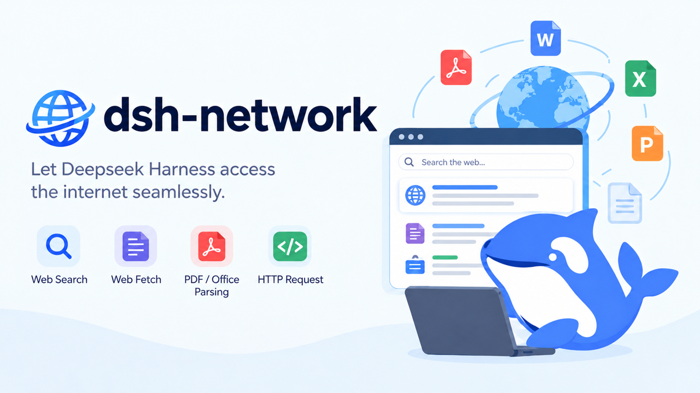
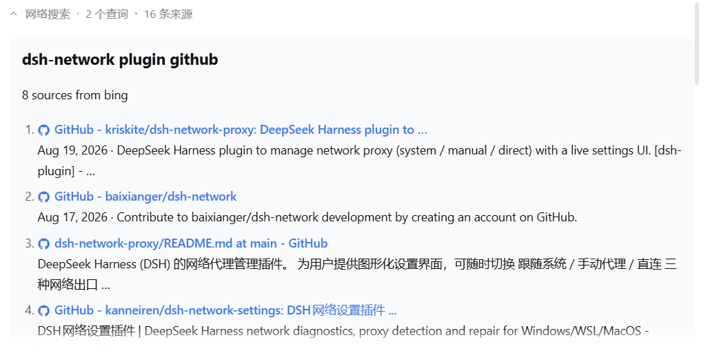
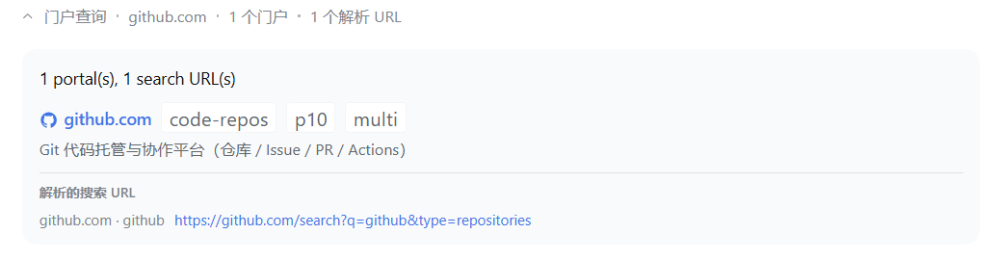
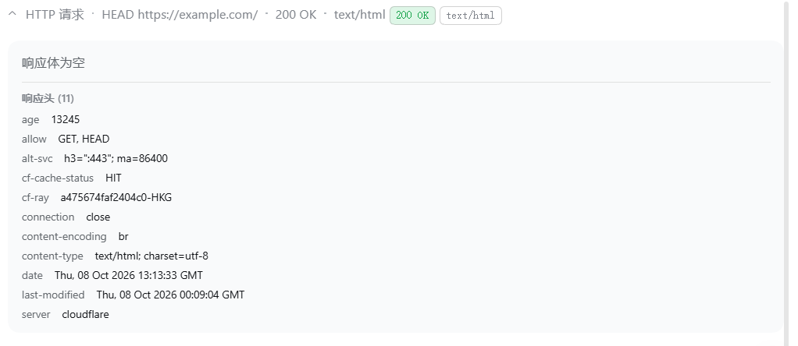
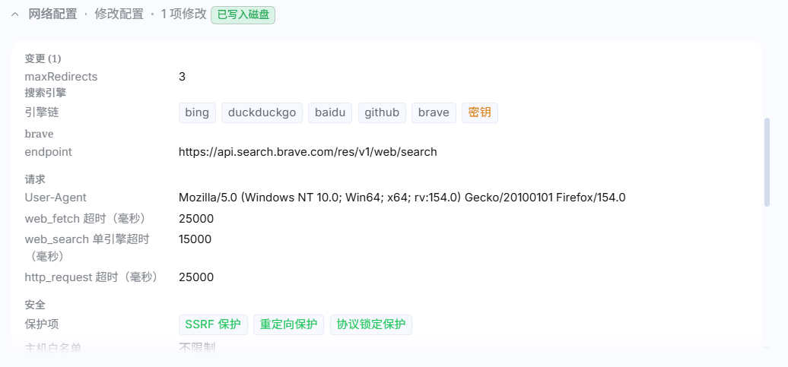

<div align="center">



# dsh-network

让 DeepSeek Harness 无缝访问互联网。

[English](README.md) | **简体中文**

[](LICENSE)
[](https://www.npmjs.com/package/@naivg/dsh-network)
[](https://github.com/deepseek-ai/deepseek-harness)
[](https://github.com/topics/dsh-plugin)
[](https://dsh.market/)
[](https://dsh-plugin.org/plugins/naivg/dsh-network)

</div>

`dsh-network` 为 DeepSeek Harness 配齐了一整套网络工具——**五个面向模型的
工具**、一个**网络设置分区**、一个**侧边栏网页搜索面板**, 以及看起来与应用其余
部分并无二致的工具卡片渲染。

它接管官方的 `tool-web` 的 `web_search` / `web_fetch`, 换成一个常驻的本地回环
Node 进程, 通过 `undici` 访问网络。超长结果会在服务端缓存中分页返回, 模型可以
越过内联上限继续往下读, 而不是丢掉尾部。默认搜索链无需任何 API key, 所有可选引擎
也都是可选的。

适用于 `dsh: 0.1.0.rc2` 及更高版本。

## 为什么需要这个插件

DeepSeek Harness 自带 `web_search` 和 `web_fetch`, 在模型撞上下面这些墙之前, 
它们基本够用:

- 长页面被截断。
- 文档直链以二进制格式返回给模型。
- 订阅源地址回来一大坨 XML, 而不是一份文章列表。
- 两个工具还不算一套网络工具箱。
- 其中没有任何环节是你能看到或者检查的。

`dsh-network` 接管 `web` 插件缝, 把这两个工具换成一个常驻的 Node 进程:

- **多搜索引擎**——默认按顺序尝试 Bing、DuckDuckGo、Baidu; GitHub、SearXNG
  和 Brave 在你需要时再加入。
- **不再截断。** 超大的抓取与 HTTP 响应体会落入服务端缓存, 模型用 `cacheId`
  分页读取, 而不是丢掉尾部。
- **五个工具**——搜索、抓取、裸的 `http_request`、精选站点查询
  (`web_sitemap`), 以及读写实时设置的 `web_config`; 另有默认关闭的
  `web_download`, 负责把二进制文件落盘(默认关, 见[设置](#设置))。
- **可引用的答案**——每条命中都带标题、链接、摘要和日期, 引擎意见不一致时还会
  显式给出不确定提示。
- **文档与订阅源以 Markdown 到达。** PDF、Word、PowerPoint、Excel、ODF 和 EPUB
  响应会被解析, 而不是丢一堆字节过来。RSS 2.0、RSS 1.0 (RDF) 与 Atom 1.0
  订阅源会逐条渲染成 Markdown, 而不是一条 **？！惊天大区！？** XML 版。
- **设置分区与侧边栏搜索面板**, 你可以调整引擎链顺序、粘贴密钥、自己搜索, 
  完全不用去改配置文件。改动在下一次工具调用时生效——无需重启。
- **默认安全**——逐跳重定向 SSRF 校验、IP 固定、私有地址段拦截和协议锁, 全部
  在进程内完成。
- **可嵌入你的应用**——dsh-network 在设计时对齐了官方 CSS 风格, 渲染出的卡片
  与宿主应用保持一致。

代价是多一个由插件自身托管的 Node 进程, 并且在你卸载之前, `web` 插件缝会一直被
占用。

## 你会得到什么

| 工具 | 作用 |
|---|---|
| `web_search` | 通过配置的引擎链搜索网络(默认 **Bing → DuckDuckGo → Baidu**)。返回可引用的来源(标题、链接、摘要、日期)、一段总结、状态标记和不确定提示。单次调用可以指定只用某一个引擎。 |
| `web_fetch` | 抓取一个 HTTP(S) 地址, 默认返回 Markdown, 也可按需返回原始响应体, 并附带出站链接与告警。PDF、OOXML(`docx`/`pptx`/`xlsx`)、ODF(`odt`/`odp`/`ods`)和 EPUB 响应会被转成干净的 Markdown, 而不是二进制字节。**RSS 2.0、RSS 1.0 (RDF) 与 Atom 1.0 订阅源按根元素识别**——`<rss>`、`<feed>`、`<rdf:RDF>`——并逐条渲染, 于是订阅源读起来是带标题、日期、作者和链接的文章列表, 而不是原始 XML([细节](docs/cli.md#feeds))。 |
| `http_request` | 发出底层 HTTP(S) 请求, 方法、请求头和请求体完全可控。 |
| `web_sitemap` | 查询一张包含 **178** 个权威站点的精选表格——覆盖 arxiv、MDN、包注册表、问答站、政府、新闻、视频……共 23 个分类——可按域名、分类、优先级或自由文本查询定位, 并可选返回可直接粘贴使用的摘要。 |
| `web_config` | 读取 dsh-network 的实时配置; 在你打开了安全开关后, 还能应用一个局部补丁(见[设置](#设置))。完整行为见[配置文档](docs/configuration.md#web_config-tool-and-the-safety-toggle)。 |
| `web_download` | **默认关闭**, 在「设置 → 网络 → 工具」里打开后, 模型才能把二进制文件(图片、压缩包、媒体、字体)存到本地并拿到路径。走的是和其他工具完全相同的传输层——同一份白名单、同一套逐跳私网拦截、同一个重定向同域锁——因为否则模型只会改用 `curl`, 而那条路上一个被注入的页面就能让它去够 `169.254.169.254`。扩展名由文件头决定而不是 URL(把 `.png` 存成 HTML 骗过你的图片读取工具没有意义), 路径逃不出目标目录, 可执行后缀直接拒绝, 超限则是**报错而不是截断**。默认落在临时目录, 只有用户明确要留档时才写进工作区。 |

### 工具卡片

每个工具都会渲染成第一方风格的 dsh 卡片——一行无边框的展开栏, 下面是结果正文:

<div align="center" class="toolview">



`web_search` 工具



`web_sitemap` 工具



`http_request` 工具



`web_config` 工具

</div>

`web_config` 也一样。读取时收成一行 `网络配置 · 读取配置 · N 个引擎`; 写入时
自动展开, 逐条列出改动的字段**以及真正存进去的值**——模型要 `searchMaxResults: 50`
而宿主钳到 20 时, 卡片显示的是那次钳制的结果, 而不是它请求的数字; 被安全开关拒绝
的写入则显示成琥珀色的「已被拒绝」块, 既不会伪装成静默无操作, 也不会列出一串
根本没发生的改动。当前配置本身以分组形式列在下面(引擎链带密钥标记、超时、保护项、
白名单、上限、工具开关、GitHub), 最底下是原始 JSON。

超过内联上限(约 20 KB)的 `web_fetch` / `http_request` 正文会先返回一段预览
加上一个 `cacheId`, 模型再用一次调用翻完剩余部分——见
[CLI 与缓存分页](docs/cli.md#cache-paging)。超长的订阅源同样这样降级, 只是预览
的截断点永远落在一条完整条目的末尾, 于是模型读完前几条后, 一次 `cacheId` 调用
就能直接翻到第 40 条, 不必重新请求这个地址。

### 支持的搜索引擎

| 引擎 id | 凭据 |
|---|---|
| `bing` | 无 |
| `duckduckgo` | 无 |
| `baidu` | 无 |
| `github` | token 可选 |
| `searxng` | 无(受 endpoint 范围限制) |
| `brave` | **需要密钥, 按量计费** |

更多细节见[搜索引擎](docs/search-engines.md)。

### 侧边栏网页搜索

dsh 网页界面会在侧边栏(位于插件与定时任务之后)新增一个**网页搜索**入口。该面板
走的是与 `web_search` 工具完全相同的搜索路径, 也受同一个开关控制。

## 安装

```bash
# 从 npm 安装:
dsh plugin --profile web add @naivg/dsh-network

# 或者从 GitHub 安装(安装期间现构建 CLI bundle):
dsh plugin --profile web add github:NaivG/dsh-network --allow-build=@naivg/dsh-network

# 或者从本地检出安装:
dsh plugin --profile web add link:<path-to-this-checkout>
cd <path-to-this-checkout>      # 仅 link 安装需要
pnpm install
pnpm build

dsh web
```

之后加载器会替你套用 `cordis.patch.yml`:`web` 插件缝的 provider 切换到 dsh-network, 
旧的 `tool-web` 的 `web_search` / `web_fetch` 被禁用, 插件条目则带着默认设置插入。

> **为什么要 `--allow-build`?** CLI bundle(`dist/cli.cjs`)是在安装期间由包的
> `prepare` 脚本构建的, 而 pnpm 12 默认拦截 git 依赖的构建脚本, 除非你显式放行。
> 如果每次工具调用都报 `dsh-network CLI bundle is missing`, 说明 prepare 脚本
> 没有执行——用上面的参数重新安装, 或者参考
> [开发文档](docs/development.md#git-installs-and-the-prepare-hook) 中的
> `allowBuilds` 方案。

## 快速开始

1. 执行 `dsh web`, 然后打开 **设置 → 网络**。只有在你希望模型能够自行修改本插件
   的设置时, 才打开**允许模型修改设置**。
2. 问一个需要联网的问题——“搜索最新的 TypeScript 发布说明并给出来源”。`web_search`
   卡片会显示各引擎的答案, 来源列在下方。
3. 更喜欢点而不是打字?打开侧边栏的**网页搜索**, 在那里跑同一个查询。
4. 添加引擎、粘贴 GitHub token, 或者在同一设置分区里调整超时——改动在下一次
   工具调用时生效, 无需重启。

全新安装后什么都不用配置:默认链是免密钥的, 而那些会产生费用(或需要你自己的
服务器)的引擎绝不会被悄悄启用。

## 设置

所有配置都在**设置 → 网络**里, 并且在下一次工具调用时生效:

- **搜索引擎**——实时引擎链(默认 Bing → DuckDuckGo → Baidu), 每个引擎有一个
  **编辑**对话框, 可以配置 endpoint、**API Key** 和自定义 `key=value` 选项。
  见[搜索引擎](docs/search-engines.md)。
- **工具开关**——`webSearchTool`、`webFetchTool`、`httpRequestTool`、
  `webSitemapTool`。关掉其中一个, 对应工具就会立刻失败; 网页搜索关闭期间, 侧边栏
  搜索路由会返回 403。重启 dsh 会彻底注销被禁用的工具。
- **`downloadTool` 默认关闭。** 这是唯一会往磁盘写东西的工具, 所以默认不开——
  开了之后模型才拿得到 `web_download`, 而且模型自己既读不到也改不了这个开关
  (和 `allowConfigEdit` 同样处理)。
- **安全**——SSRF 防护、重定向防护和协议锁默认开启, 就在上面那个模型设置开关
  旁边。
- 超时、User-Agent、结果上限、重定向预算、允许的 HTTP 方法以及主机允许列表, 
  都在同一个分区里。

设置持久化到 `~/.dsh/dsh-network.json`; 删掉该文件即可重置。密钥(GitHub token、
引擎 API key)也会存在那里——浏览器只会显示“是否已配置密钥”, 绝不会显示密钥本身。
包含回环路由在内的完整字段参考见[配置文档](docs/configuration.md)。

## 安全

- 所有流量都走 `undici`。插件绝不会外呼 `curl.exe`、`nslookup.exe` 或任何其
  他外部可执行文件。
- 逐跳重定向 SSRF 校验、IP 固定、私有/保留地址段拦截默认开启; 在你设置之前, 
  允许列表为空(不受限)。
- 传输层会拒绝真正的二进制内容(图片、音频、视频、字体、压缩包、通用octet-stream)。
  只有一份固定白名单中的文档 MIME 类型会被解析成 Markdown。唯一的例外是
  `web_download` 显式请求落盘时——而且它走的是同一个传输层, 不是另开一条管道。
- 回环服务只绑定 `127.0.0.1`, 并且对请求体做了大小限制。
- `web_config` 的 `set` 动作由一个开关把守, 该开关模型既读不到也写不了, 因此
  一次坏补丁不可能把模型锁死在它自己的写入通道之外。
- `web_download` 另外三道闸: 文件名无法逃出目标目录(分隔符、`..`、Windows 保留
  设备名全部中和, 落盘前再校验一次解析后的路径); 可执行后缀(`.exe`/`.ps1`/
  `.sh`/`.js`/`.bat`……)直接拒绝, 声明名和嗅探名都要过这一关; 超过字节上限是
  **失败**而不是截断, 而且写入是原子的(`.part` → rename), 所以磁盘上存在的文件
  一定是完整的。

## 故障排查

- **`npx @naivg/dsh-network doctor`** 会打印解析后的配置——引擎链、超时、哪些
  API key 已配置——且不会访问任何外部服务。离线可用, 是排查的第一站。
- **`dsh-network CLI bundle is missing`**——CLI 构建被跳过了, 这只会发生在 git
  或 link 安装上(发布到 npm 的 tarball 自带 `dist/`)。GitHub 安装请用
  `--allow-build=@naivg/dsh-network` 重新安装, link 安装则在检出目录里执行
  `pnpm install && pnpm build`。见
  [开发文档](docs/development.md#git-installs-and-the-prepare-hook)。
- **某个带密钥的引擎提示"无凭据"**——在该引擎的**编辑**对话框里粘贴密钥并保存; 
  只有真正存下密钥后, 行上的徽标才会变绿。凭据规则见
  [搜索引擎](docs/search-engines.md#credentials)。
- **SearXNG 返回 403**——在你实例的 `settings.yml` 里为 `search.formats` 启用
  `json`。见[搜索引擎](docs/search-engines.md#searxng)。
- **侧边栏搜索面板不见了**——它只有在插件存在且网页搜索开关打开时才会挂载。
- **想全部重置?** 删除 `~/.dsh/dsh-network.json`(路径可由
  `DSH_NETWORK_CONFIG_FILE` 覆盖)并重启 dsh。

## 文档

> 以下文档目前仅提供英文版。

- [搜索引擎](docs/search-engines.md)——引擎链、按调用锁定, 以及每个引擎的凭据
  与选项。
- [CLI 与缓存分页](docs/cli.md)——独立 CLI、结果信封格式, 以及缓存如何分页。
- [配置](docs/configuration.md)——全部字段、全部环境变量、回环路由。
- [架构](docs/architecture.md)——进程模型、传输层、引擎注册表、浏览器端实现。
- [开发](docs/development.md)——构建、测试、代码结构。

## 致谢

- [Deepseek Harness](https://github.com/deepseek-ai/deepseek-harness)——插件设计、实现与参考资料。
- [Deepseek](https://deepseek.com)——社交预览图中的 deepseek 参考形象。

## 许可证

MIT。见 [LICENSE](LICENSE)。
